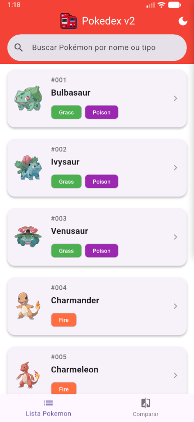
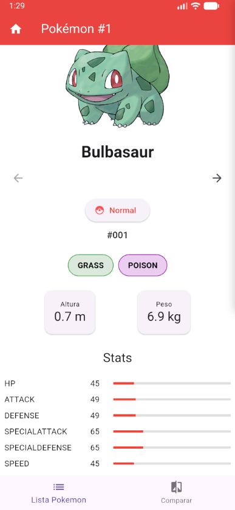
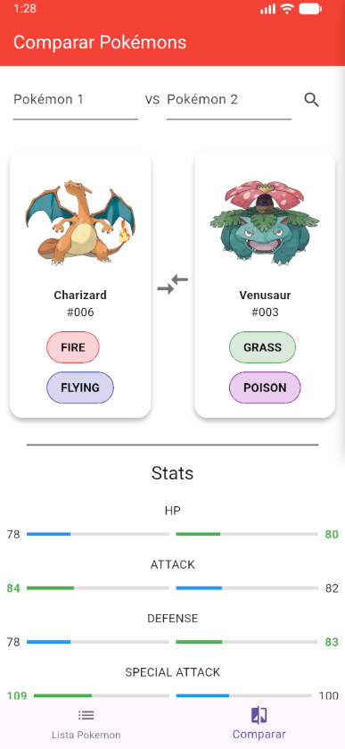

# 📑 Pokedex Simplificada v2

<p align="center">
  
</p>

<p align="center">
  
  
  
</p>

<p align="center">
  
  
  
</p>

<p align="center">
  <b>Uma experiência Pokémon moderna, ultra-rápida e acessível.</b><br>
  Construída com Flutter, consumindo a <a href="https://pokeapi.co/">PokeAPI</a>, focando em padrões de arquitetura escaláveis e performance.
</p>

---

## 🚀 Demonstração
<p aling="center">
| Listagem Principal | Detalhes & Stats | Comparação Dinâmica |
|---|---|---|
|  |  |  |

</p>

> 💡 **Dica:** Experimente a busca com autocomplete para encontrar seu Pokémon favorito em milissegundos.

---

## ✨ Funcionalidades Core

* 🔍 **Smart Search:** Sistema de busca com sugestões em tempo real.
* ⚖️ **Versus Mode:** Comparação técnica lado a lado via Deep Links (`/compare?pokemon1=...&pokemon2=...`).
* 🎨 **Adaptive UI:** Suporte nativo a Dark/Light mode e design responsivo.
* ♿ **Acessibilidade:** Uso de `Semantics`, navegação por teclado e contraste revisado.
* ⚡ **Alta Performance:** Lazy loading, cache de imagens e animações suaves.

---

## 🏗️ Arquitetura e Engenharia

O projeto segue o padrão **MVVM**, garantindo separação clara entre models, viewmodels e views.

### Stack Tecnológica
* **Estado:** `result_command` + `CommandBuilder`.
* **Navegação:** `go_router` com `ShellRoute`.
* **Injeção de Dependência:** `get_it`.
* **Dados:** `dio`, `json_serializable` e `freezed`.

---

### Estrutura de Pastas
```text
lib/
├── core/                # Injeção de dependência, rede e router.
├── features/            # Divisão por funcionalidades.
│   ├── pokemon_list/
│   ├── pokemon_detail/
│   └── pokemon_compare/
└── main.dart            # Ponto de entrada.
```
---

## Diferenciais

* Código limpo, modular e testável
* Cobertura de testes unitários e de widget
* Acessibilidade real (labels, navegação por teclado, contraste)
* Performance otimizada (cache de imagens, lazy loading)
* Pronto para produção em Android, iOS, Web e Desktop
* Documentação e exemplos completos
* README sempre atualizado

---

🛠️ Instalação e Setup
# 1. Clonar e Instalar
* Bash

* git clone [https://github.com/kaiquecardeal/pokedex_simplificada_v2.git](https://github.com/kaiquecardeal/pokedex_simplificada_v2.git)
* cd pokedex_simplificada_v2
* flutter pub get

# 2. Geração de Código
* Bash

* dart run build_runner build --delete-conflicting-outputs

# 3. Executar
* Bash

* flutter run # Selecione a plataforma (Chrome, Android, iOS, Desktop)

---

##🧪 Qualidade de Software

# Testes unitários e de widget com 100% de cobertura.
* Bash

# Executar testes
* flutter test

# Relatório de coberftura
* flutter test --coverage
* genhtml coverage/lcov.info -o coverage/html

---

## 🔧 Troubleshooting

* Erro de build: Tente flutter clean seguido de flutter pub get.

* CORS na Web: Use o Chrome com flags de segurança desabilitadas para testes locais.

---

## 👤 Desenvolvedor

* Kaique Cardeal — kaiquecardeal@outlook.com

* Projeto desenvolvido em 2026.
---
